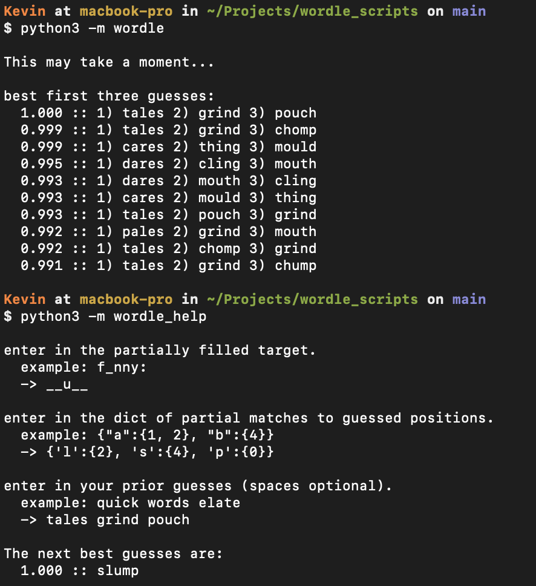
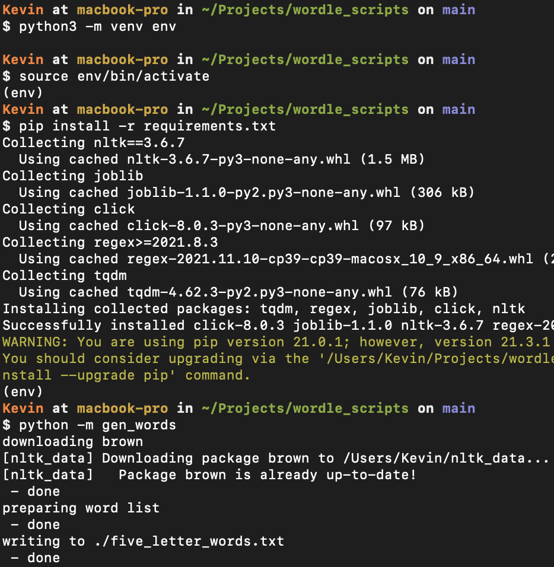
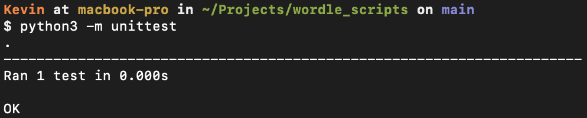

# wordle_scripts
Repo of scripts I use to boss Wordle 🤓

---

# Running
This was written for Python 3.

## Playing 

### Generating the First Three Guesses

```bash
python3 -m wordle
```

### Generating Subsequent Guesses

This program prompts for the current game state, then returns a few good guesses.

(Skip guesses that are not part of the game.)

```bash
python3 -m wordle_help
```



---

## [OPTIONAL] Generating the word list.
The current implementation uses `nltk.corpus.brown`

### `1` Setup & use the virtual environment (only necessary for generating words).

```bash
python3 -m venv env
```
```bash
source env/bin/activate
```
```bash
pip install -r requirements.txt
```

### `2` Run the script to download nltk data, load the corpus, filter it, then write five-letter words to file.

```bash
python -m gen_words
```



---


# Testing

## Unit Tests

Unit tests are based of of `unittest` and located with `./test`

To run: `python3 -m unittest`



